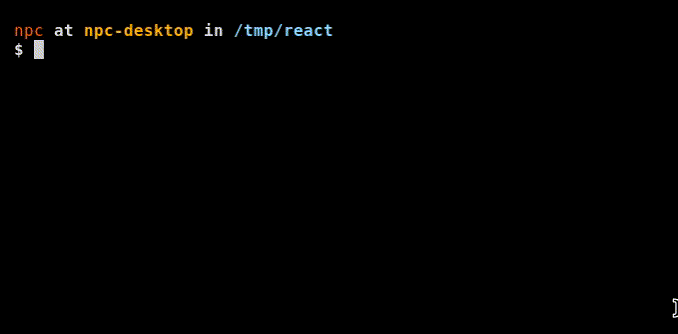
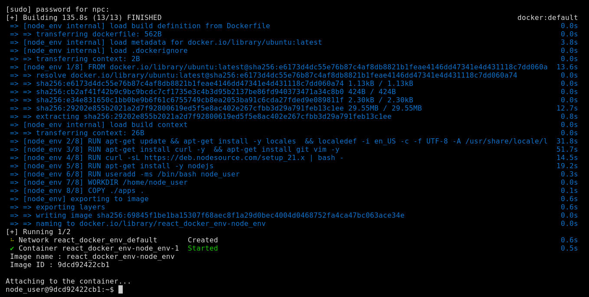
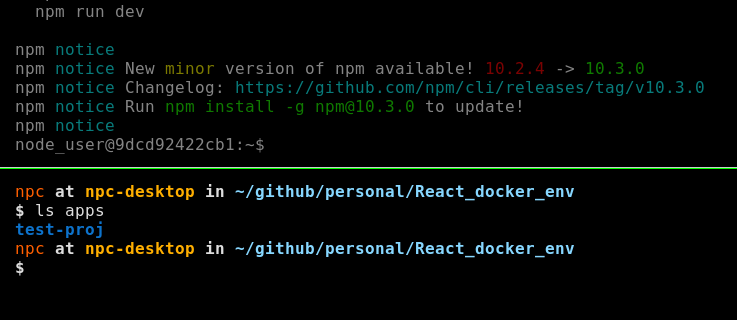

# About

This is a scrip I made for my local ReactJS development. I don't use NodeJS or NPM package manager and don't have the need to install NodeJS locally. Hence I build this scrip and Docker files that allow me to run NodeJS inside a container when needed, where the files are accessible from my host machine and the data stays persistent between the container and the host machine.

# Why not use some NodeJS Docker image?

I tried to use few images but they don't fit my needs. My requirement is simple where I can create and run NodeJS apps within container but should have access to those files so that I can use my local editor to edit them and the app should be accessible from my local browser.

# How does it work?

There are three files int this repo :

* `Dockerfile` : Pulls up Ubuntu image, install necessary packages, install NodeJS, sets up a directory to work on.
* `compose.yaml` : Builds the image from the `Dockerfile`, sets up the volume mounts and responsible to start the container.
* `start_node_env.sh` : Runs the `compose.yaml` file and attaches it container shell.

# How to use it?

1. Clone the repo :

        git clone https://github.com/YenruoY/NodeJS-docker-env.git

1. Add execute permission to the bash script :
    
        chmod +x start_node_env.sh

1. Run the script :

        ./start_node_env.sh

    

The script will take time when ran first time as it will pull the Ubuntu image and then install necessary packages including NodeJS. For the next time it will start the container and will attach to the container shell.


From the shell you can build any project using `npm create` command. When you run any app you can access the app through your host machine browser by going to `http://127.0.0.1:8000`. If the app page does not show up then go to the **Notes** section in the end.

After completing your work, you can stop the container by using `sudo docker compose down` command.


# File organization

The `./apps` folder in this repo is mounted to the `/home/node_user/` directory inside the container. Any changes made in the directory whether from the host machine or inside the container will reflect to both. And the files generated in that directory through the container will persist in the host machine even if the container is down. 



# Dependencies 

1. Docker engine
1. Docker compose

## Note

When building projects from tools like Vite, the app will be accessible by default. This is because by default Vite dev server binds to localhost. That means other devices in the network won't be able to access it. 

To fix it you have to start the server with the `--host` option. This is done by editing the `package.json` file. In the file change `"dev" : "vite"` to `"dev" : "vite --host"`.

    ```
    ...
    "scripts" : {
        "dev" : "vite --host",
        "build" : "vite build",
        "preview" : "vite preview"
    },
    ...
    ```
And then start the server normally :

        npm run dev

Now the application should be accessible.
